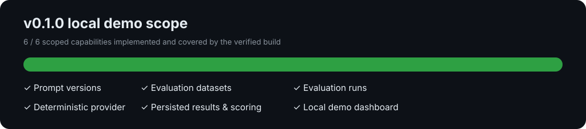
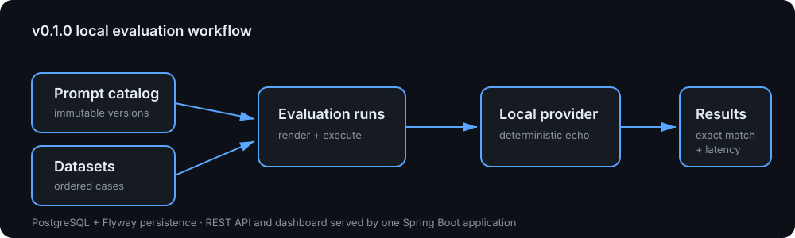
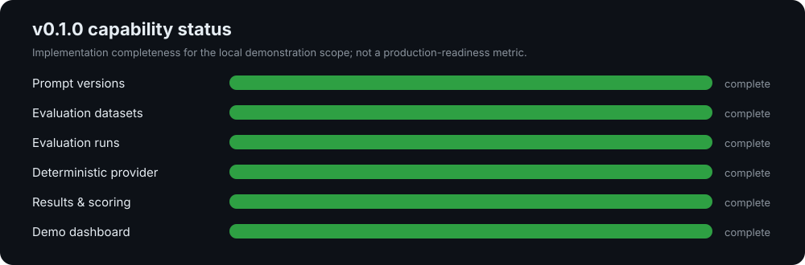

# Prompt Evaluation Platform

A cloud-neutral platform for versioning prompts, running repeatable evaluations, and comparing local LLM outputs before a prompt or model change reaches production.

> **Status:** public work in progress. Core prompt-version and dataset APIs are available; the evaluation-run workflow is tracked in the [v0.1.0 milestone](../../milestone/1). This repository does not yet represent a production release.

## Release progress



The progress view is a manual, scope-based snapshot of the [v0.1.0 milestone](../../milestone/1); it is intentionally not derived from commit count or activity volume.

## Problem

Prompt changes are software changes, but many teams cannot reproduce, compare, or approve them with the same discipline as code. This project makes prompt releases measurable with datasets, evaluation criteria, run history, and model comparisons.

## Planned capabilities

- Prompt templates with immutable versions
- Evaluation datasets and expected-result criteria
- Local/Ollama-compatible model adapters
- Repeatable evaluation runs with latency and token metrics
- Prompt/model comparison and release quality gates
- PostgreSQL persistence, Flyway, Prometheus metrics, Docker, Kubernetes, and React

## Architecture

The first release is a modular monolith. Its domain boundaries are prompt catalog, dataset management, execution, evaluation, and reporting. This keeps local setup simple while preserving future extraction paths.



## Capability chart




## Technology

Java 21, Spring Boot, PostgreSQL, React, Maven, Docker, Kubernetes, Prometheus, and optional Ollama. The local development path uses only free and open-source software.

## Local API usage

Run PostgreSQL locally, set `SPRING_DATASOURCE_URL`, `SPRING_DATASOURCE_USERNAME`, and
`SPRING_DATASOURCE_PASSWORD`, then start the application with `./mvnw spring-boot:run`.
Flyway creates the prompt catalog tables on startup.

Create a template; its submitted content becomes immutable version 1:

```sh
curl -i -X POST http://localhost:8080/api/prompt-templates \
  -H 'Content-Type: application/json' \
  -d '{"name":"support-summary","content":"Summarize this ticket: {{ticket}}"}'
```

Create a revision by using the returned template ID. Existing versions are retained unchanged:

```sh
curl -i -X POST http://localhost:8080/api/prompt-templates/<template-id>/versions \
  -H 'Content-Type: application/json' \
  -d '{"content":"Give a concise summary of this ticket: {{ticket}}"}'
```

Retrieve a template and its versions, ordered by version number:

```sh
curl -i http://localhost:8080/api/prompt-templates/<template-id>
```

Template names must be non-blank and at most 120 characters. Version content must be non-blank
and at most 50,000 characters.

Create an evaluation dataset with one or more repeatable cases. Each case supplies prompt input
variables and the output expected by a future evaluator:

```sh
curl -i -X POST http://localhost:8080/api/evaluation-datasets \
  -H 'Content-Type: application/json' \
  -d '{
    "name":"support-ticket-classification",
    "cases":[{
      "inputVariables":{"ticket":"I cannot log in"},
      "expectedOutput":"Login issue"
    }]
  }'
```

Retrieve a dataset and its cases, ordered by case number, using the returned dataset ID:

```sh
curl -i http://localhost:8080/api/evaluation-datasets/<dataset-id>
```

Dataset names must be non-blank and at most 120 characters. A dataset needs at least one case;
case input-variable keys are non-blank and at most 120 characters, while input values and expected
outputs are limited to 50,000 characters. Cases are retained in their submitted order.

## Engineering standards

- Issues, feature branches, and pull requests
- AI-assisted changes labeled explicitly
- CI before merge
- Minimum 70% line coverage
- No empty commits or synthetic activity

## License

[MIT](LICENSE)
